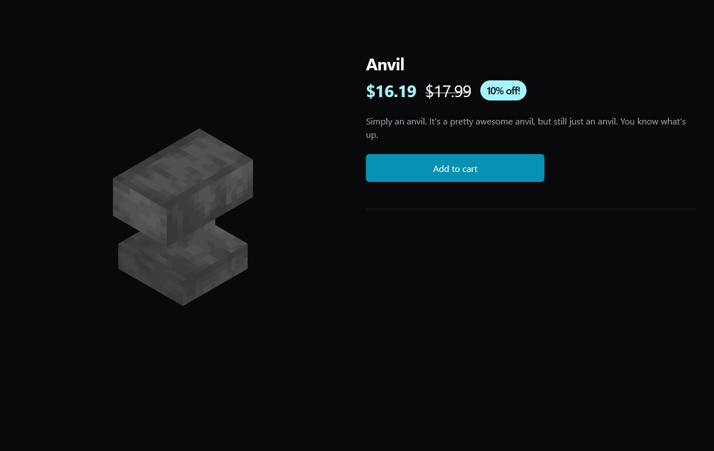
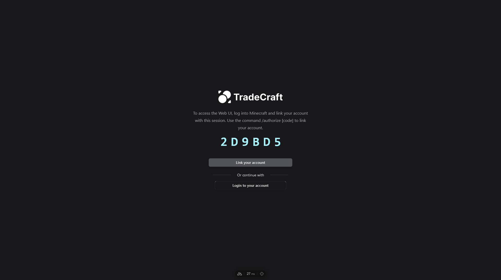
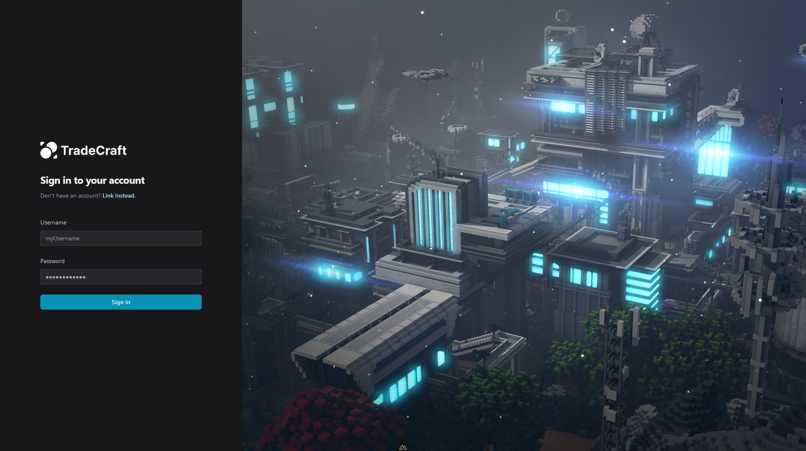
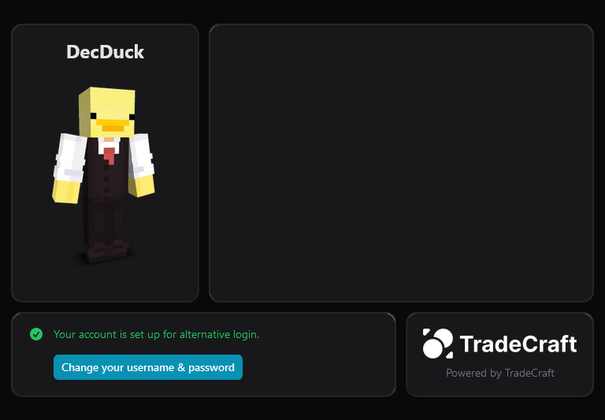

# TradeCraft
TradeCraft is a Paper/Bukkit plugin that overhauls economy into a full-fledged system with loans, companies, orders, currency and more! It features a beautiful web UI that allows players to create, manage and sell companies, items and more on the server.

## Vault Integration
TradeCraft implements the Vault API, meaning it seamlessly connects with your pre-existing economy plugins. In addition, TradeCraft provides it's own API for other plugins to gain more control over how they interact with TradeCraft. Both options are, however, **fully supported.**

## Web UI
TradeCraft includes a beautiful, reactive web UI that's bundled with an API. The web UI, while not *strictly* required, is highly recommended as many of the options within the web UI are far easier to understand and modify.

## Customisable & Scalable
TradeCraft, as well as implementing standard APIs, also includes are variety customisation methods. From Redis session servers to a variety of SQL database options, TradeCraft can be run on anything, from a small SMP to a large multi-server deployment.

# Showcase

